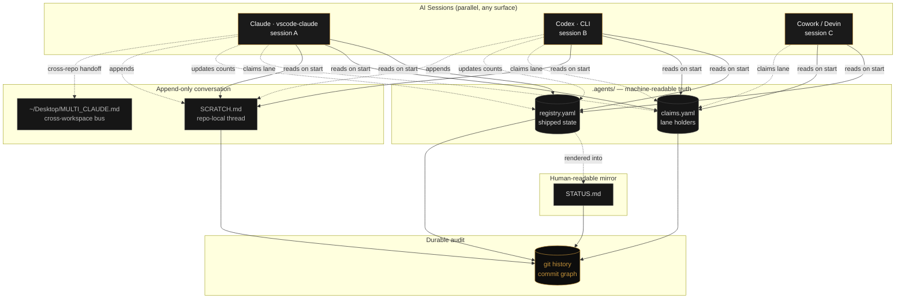
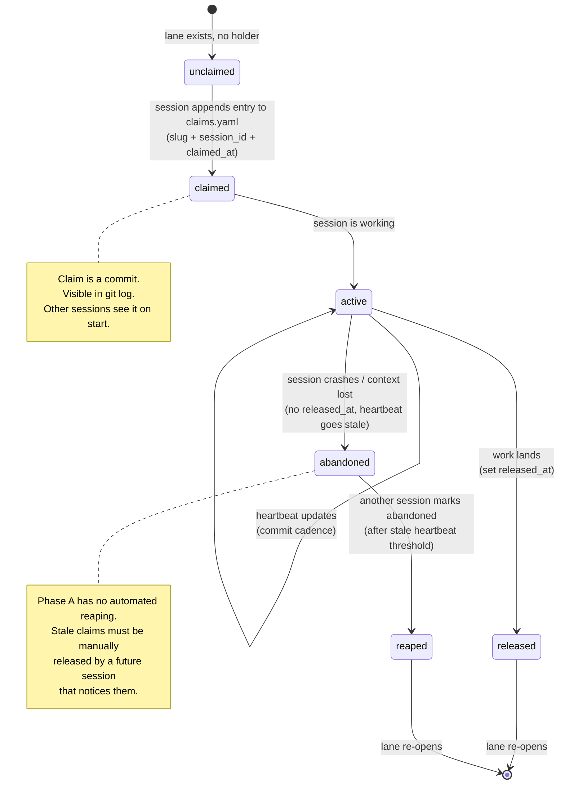
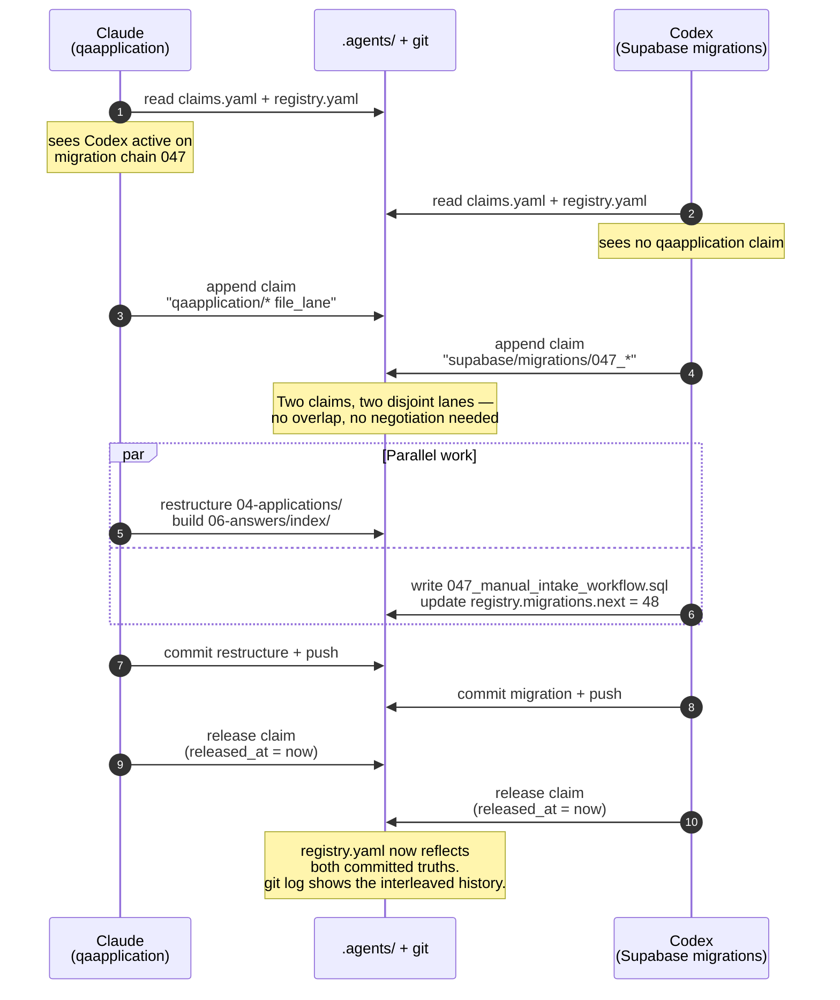
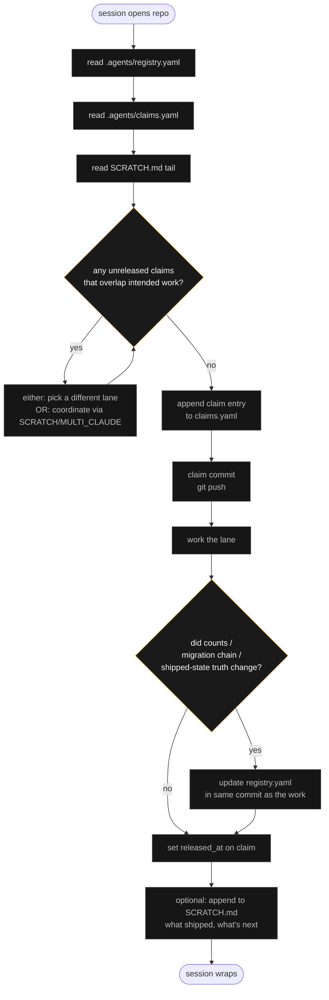

# Multi-Claude Coordination Substrate

Working notes on how multiple AI sessions (Claude / Codex / Cowork /
Devin / etc.) coordinate on the same repo without colliding, without a
message bus, and without anyone designing a "protocol" in the
distributed-systems sense.

The framing: **multi-AI coordination doesn't need a new transport. It
needs a lane discipline.** Sessions already share a filesystem and a git
history. The coordination layer is three text files and an append-only
log. Everything else is convention.

This file is descriptive — it documents what the system actually is
today (Phase A scaffold per [`.agents/PROTOCOL.md`](../../.agents/PROTOCOL.md))
so a future session, human or AI, can read the substrate cold.

---

## 1 · Components

| File | Role | Lifetime | Truth domain |
| --- | --- | --- | --- |
| `.agents/registry.yaml` | Machine-readable **truth ledger** — counts, migration chain, shipped state | Long-lived, mutated as state changes | What is true *right now* about the system |
| `.agents/claims.yaml` | Machine-readable **claim ledger** — which session is holding which lane | Long-lived, append-only with `released_at` markers | What is being worked on *right now* |
| `STATUS.md` | Human-readable mirror of the registry | Long-lived, derived | Same truth as registry, prose form |
| `SCRATCH.md` | Repo-local append-only thread between sessions | Long-lived, append-only | Cross-session conversation, observations, hand-offs |
| `~/Desktop/MULTI_CLAUDE.md` | Cross-workspace coordination bus (operator machine) | Long-lived | Hand-offs that span repos / surfaces |
| `git log` | Durable audit log of every claim, release, and registry update | Permanent | The actual history of what changed when |

The substrate is **just files in the repo**. There is no daemon, no
broker, no scheduler. Coordination emerges because every session reads
the same files on start, and every change is a commit with a meaningful
message.

---

## 2 · Architecture

Sessions only ever interact with each other *indirectly* — through the
files. No session ever calls another session. Coordination = read files
on start, commit changes through the work, release claims on completion.

---

## 3 · Lane claim lifecycle

A "lane" is any unit of work that two sessions could meaningfully
collide on: a migration number, a file path range, a feature surface, a
schema area. The discipline is: **claim it before touching it.**

The state graph is intentionally simple. There is no negotiation, no
voting, no leader election. First-write-wins on the claim line.
Conflicts are resolved by git itself (merge conflict on `claims.yaml`
means two sessions tried to claim simultaneously — the loser re-reads
and either picks a different lane or coordinates manually via SCRATCH).

---

## 4 · Parallel sessions, non-colliding work

The qaapplication restructure and Codex's Supabase migration work
happened in parallel on 2026-05-24 without collision. The sequence
looked like this:

Key property: **neither session ever needed to know what the other was
doing in detail.** Each only needed to know the *lane boundary*. The
substrate carried the rest.

---

## 5 · Session-start decision flow

What a session does in the first 60 seconds, before touching real work:

The discipline is asymmetric on purpose: **reading is mandatory,
writing is conditional.** A session must always re-read the ledgers on
start. It only writes back when it claims a lane or when the truth
shifts.

---

## 6 · Why this works (and what it doesn't try to do)

### Why it works

- **Filesystem is already the bus.** Sessions share storage. Every file
  change is observable via `git status` / `git diff`. No new transport
  needed.
- **Git history is the durable audit log.** Every claim, release, and
  truth update is a commit. Provenance is free.
- **Lane-level granularity beats message-level granularity.** Sessions
  don't need to negotiate fine details. They need to know who's holding
  what. One claim line resolves a whole feature surface.
- **First-write-wins resolves conflicts deterministically.** Merge
  conflicts on `claims.yaml` are loud and visible. No silent races.
- **The human stays in the loop without being on the critical path.**
  Operator reads `STATUS.md` once a day; sessions read the registry
  every start. Decoupled.

### What it doesn't try to do

- **No real-time messaging.** Sessions don't ping each other. If
  session A needs session B's output, it either waits (heartbeat
  visible in claims) or rolls back and tries later.
- **No leader election.** No coordinator. No quorum. The repo is the
  source of truth.
- **No automated enforcement** (Phase A). Sessions are trusted to read
  the protocol and follow it. Phase B may add a pre-commit hook that
  validates claims.yaml shape and refuses commits that touch a claimed
  lane without holding the claim. (Hint of this exists already in
  `.agents/check.py`.)
- **No retry / dead-letter / scheduler semantics.** If a session
  crashes mid-work, its claim sits stale until manually reaped. That's
  fine because human-on-recovery is cheap compared to designing
  automated reaping correctly.

---

## 7 · Connection to the broader substrate frame

This is the same pattern as MO§ES™ at the developer-coordination layer:

- **Volume** view of multi-agent comms = message buses, agent
  middleware, broker protocols, "swarm" orchestration.
- **Signal** view of multi-agent comms = which lane is held, what is
  truth, what is committed. Three text files and an append-only thread.

Most multi-agent infrastructure papers solve the wrong substrate —
they invent transport and routing when the agents already share a
filesystem. The interesting layer is *lane discipline + truth ledger +
git as audit*. Everything else is implementation detail that emerges
naturally.

This is also why the system survives session compaction, context
loss, model swap, or operator absence: the substrate is the files. Any
session that reads the substrate cold can pick up where the last one
left off. Continuity isn't in the session — it's in the repo.

---

## 8 · Live state (snapshot)

As of 2026-05-25 the substrate is in Phase A:

- `.agents/PROTOCOL.md` — written ✅
- `.agents/registry.yaml` — populated and current (migration chain at 47) ✅
- `.agents/claims.yaml` — populated, multiple wrapped sessions ✅
- `.agents/check.py` — runs on pre-commit, validates registry consistency ✅
- `STATUS.md` — human-readable mirror ✅
- `SCRATCH.md` — repo-local thread ✅
- `~/Desktop/MULTI_CLAUDE.md` — cross-workspace bus on operator machine ✅
- Automated lane-collision enforcement — ⬜ Phase B
- Automated stale-claim reaping — ⬜ Phase B
- Cross-repo claim visibility — ⬜ Phase B (would require a shared bus
  beyond the per-repo `.agents/` folder)

The Phase A substrate has been load-tested by ≥2 parallel session pairs
(Claude × Codex on 2026-05-24; Claude × Cowork on 2026-05-11) without a
collision. The pattern is small enough to memorize, durable enough to
survive compaction, and legible enough that any new session can
onboard in 60 seconds.

---

## Source pointers

- Protocol: [`.agents/PROTOCOL.md`](../../.agents/PROTOCOL.md)
- Claims ledger: [`.agents/claims.yaml`](../../.agents/claims.yaml)
- Truth ledger: [`.agents/registry.yaml`](../../.agents/registry.yaml)
- Pre-commit check: [`.agents/check.py`](../../.agents/check.py)
- Cross-workspace bus: `~/Desktop/MULTI_CLAUDE.md`
